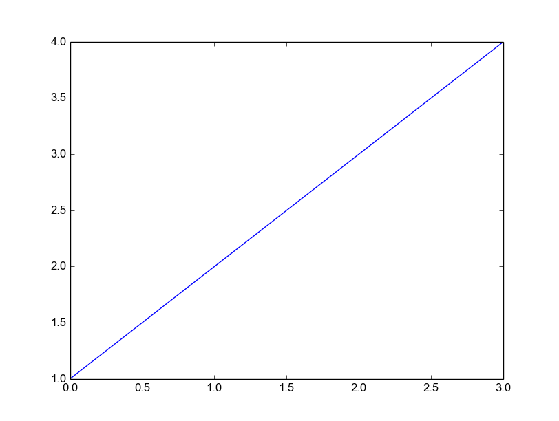
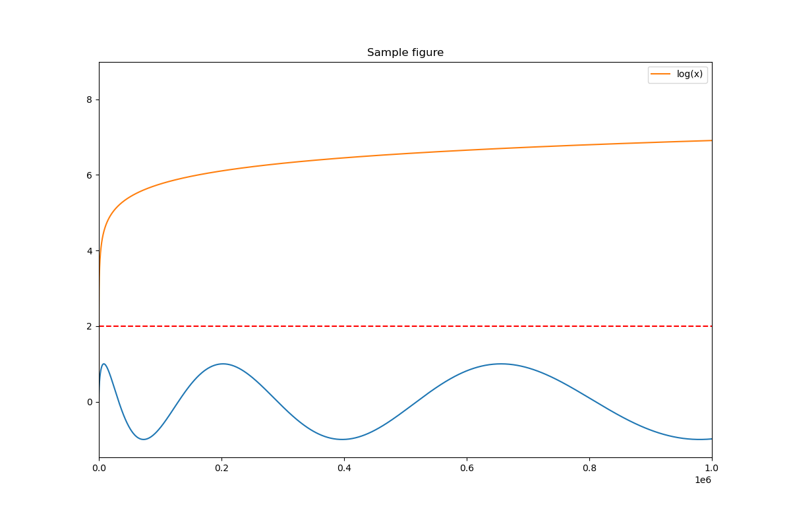
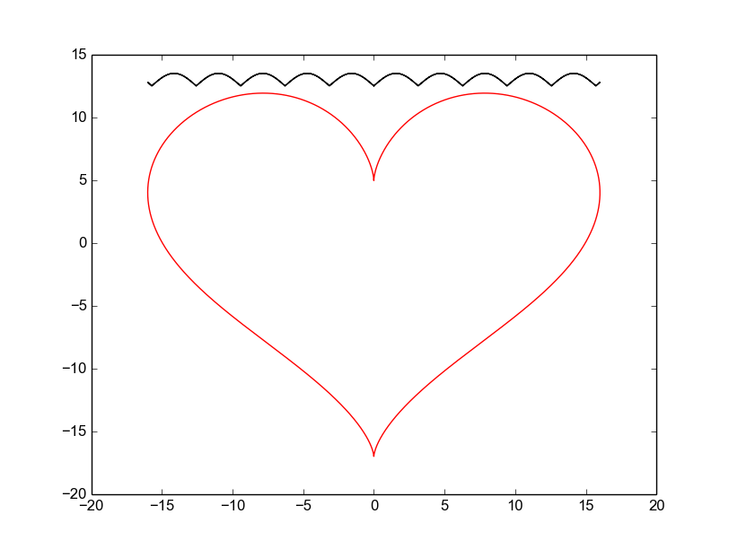

matplotlib-cpp
==============

Welcome to matplotlib-cpp, possibly the simplest C++ plotting library.
It is built to resemble the plotting API used by Matlab and matplotlib.

Usage
-----
Complete minimal example:

    #include "matplotlibcpp.h"
    namespace plt = matplotlibcpp;
    int main() {
        plt::plot({1,2,3,4});
        plt::show();
    }
    
    // g++ minimal.cpp -std=c++11 -lpython2.7

Result: 

A more comprehensive example:

    #include "matplotlibcpp.h"
    #include <cmath>

    namespace plt = matplotlibcpp;

    int main() 
    {
        // Prepare data.
        int n = 5000;
        std::vector<double> x(n), y(n), z(n), w(n,2);
        for(int i=0; i<n; ++i) {
            x.at(i) = i*i;
            y.at(i) = sin(2*M_PI*i/360.0);
            z.at(i) = log(i);
        }

        // Plot line from given x and y data. Color is selected automatically.
        plt::plot(x, y);
        // Plot a red dashed line from given x and y data.
        plt::plot(x, w,"r--");
        // Plot a line whose name will show up as "log(x)" in the legend.
        plt::named_plot("log(x)", x, z);

        // Set x-axis to interval [0,1000000]
        plt::xlim(0, 1000*1000);
        // Enable legend.
        plt::legend();
        // Save the image (file format is determined by the extension)
        plt::save("./basic.png");
    }

    // g++ basic.cpp -lpython2.7

Result: 

matplotlib-cpp doesn't require C++11, but will enable some additional syntactic sugar when available:

    #include <cmath>
    #include "matplotlibcpp.h"

    using namespace std;
    namespace plt = matplotlibcpp;

    int main() 
    {    
        // Prepare data.
        int n = 5000; // number of data points
        vector<double> x(n),y(n); 
        for(int i=0; i<n; ++i) {
            double t = 2*M_PI*i/n;
            x.at(i) = 16*sin(t)*sin(t)*sin(t);
            y.at(i) = 13*cos(t) - 5*cos(2*t) - 2*cos(3*t) - cos(4*t);
        }

        // plot() takes an arbitrary number of (x,y,format)-triples. 
        // x must be iterable (that is, anything providing begin(x) and end(x)),
        // y must either be callable (providing operator() const) or iterable. 
        plt::plot(x, y, "r-", x,  { return 12.5+abs(sin(d)); }, "k-");

        // show plots
        plt::show();
    } 
    
    // g++ modern.cpp -std=c++11 -lpython

Result: 

Installation
------------
matplotlib-cpp works by wrapping the popular python plotting library matplotlib. (matplotlib.org)
This means you have to have a working python installation, including development headers.
On Ubuntu:

    sudo aptitude install python-matplotlib python2.7-dev

The C++-part of the library consists of the single header file `matplotlibcpp.h` which can be placed
anywhere.
Since a python interpreter is opened internally, it is necessary to link against `libpython2.7` in order to use
matplotlib-cpp.

# Python 3

The code is written in a way that should support both python2 and python3.
By default, matplotlib-cpp will try to "just work" and include the header `python2.7/Python.h`.

To modify this behaviour the define `MATPLOTLIBCPP_PYTHON_HEADER`,
can be set to an absolute or relative path: 

     #define MATPLOTLIBCPP_PYTHON_HEADER /usr/include/python3.6/Python.h
     #include "matplotlibcpp.h"

or

    g++ -DMATPLOTLIBCPP_PYTHON_HEADER=Python.h -I/usr/include/python3.6 <...>

Why?
----
I initially started this library during my diploma thesis. The usual approach of 
writing data from the c++ algorithm to a file and afterwards parsing and plotting
it in python using matplotlib proved insufficient: Keeping the algorithm
and plotting code in sync requires a lot of effort when the C++ code frequently and substantially 
changes. Additionally, the python yaml parser was not able to cope with files that
exceed a few hundred megabytes in size.

Therefore, I was looking for a C++ plotting library that was extremely to use
and easy to add into an existing codebase, preferrably header-only. When I found
none, I decided to write one myself, which is basically a C++ wrapper around
matplotlib. As you can see from the above examples, plotting data and saving it
to an image file can be done is as few as two lines of code.

The general approach of providing a simple C++ API for utilizing python code
was later generalized and extracted into a separate, more powerful
library in another project of mine, [wrappy](http://www.github.com/lava/wrappy).

Todo/Issues/Wishlist
--------------------
* This library is not thread safe. Protect all concurrent access with a mutex.
  Sadly, this is not easy to fix since it is not caused by the library itself but
  by the python interpreter, which is itself not thread-safe.

* It would be nice to have a more object-oriented design with a Plot class which would allow
  multiple independent plots per program.

* Right now, only a small subset of matplotlibs functionality is exposed. Stuff like xlabel()/ylabel() etc. should
  be easy to add.

* A lot of copying could be avoided if we generate numpy arrays directly instead of python lists

* If you use Anaconda on Windows, you might need to set PYTHONHOME to Anaconda home directory and QT_QPA_PLATFORM_PLUGIN_PATH to %PYTHONHOME%Library/plugins/platforms. The latter is for especially when you get the error which says 'This application failed to start because it could not find or load the Qt platform plugin "windows"
in "".'
